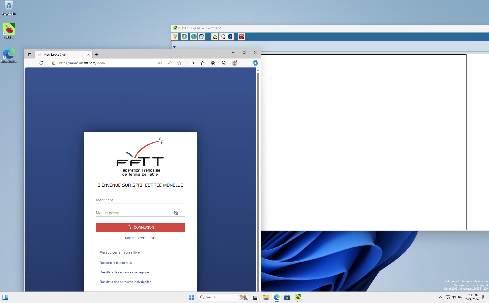
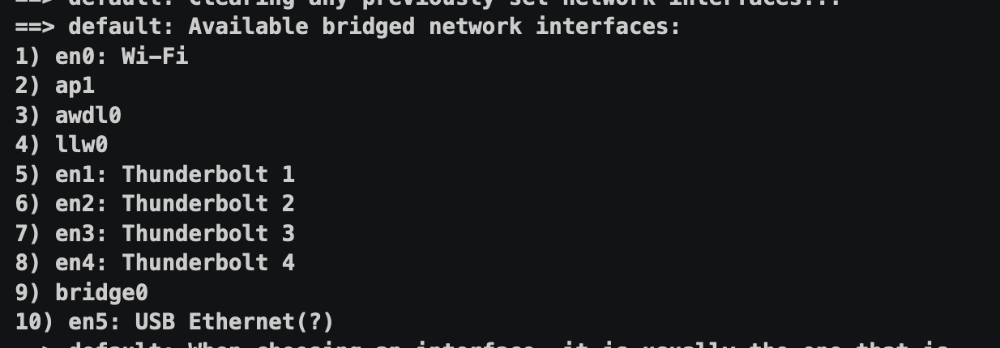

# GIRPE Vagrant

## Introduction

Ce projet vise à simplifier le déploiement et la configuration de l'environnement nécessaire pour exécuter GIRPE sur une machine virtuelle.
GIRPE, développé par la Fédération Française de Tennis de Table (FFTT), est une application essentielle pour la gestion des résultats et des compétitions de tennis de table.

Le but premier de ce projet était de rendre l'utilisation de GIRPE possible et simple sous Linux et macOS.
En utilisant Vagrant, une solution de virtualisation de boîtes légère et portable, vous êtes en mesure de fournir un environnement de développement et de test cohérent, indépendamment du système d'exploitation hôte.

## Prérequis

Avant de commencer à utiliser ce projet de provisionnement Vagrant pour GIRPE, assurez-vous d'avoir les éléments suivants installés sur votre système :

- Vagrant: Vagrant est un logiciel open-source permettant de créer et de gérer des environnements de développement virtualisés. Assurez-vous de disposer de la dernière version de Vagrant installée sur votre système. Vous pouvez le télécharger à partir du site officiel de Vagrant : https://www.vagrantup.com/.

- VirtualBox: VirtualBox est un logiciel de virtualisation open-source largement utilisé. Il est pris en charge par défaut par Vagrant. Assurez-vous d'avoir VirtualBox installé sur votre système si vous prévoyez d'utiliser le fournisseur VirtualBox pour Vagrant. Vous pouvez le télécharger à partir du site officiel de VirtualBox : https://www.virtualbox.org/.

- Connexion Internet stable : Assurez-vous d'avoir une connexion Internet stable et rapide, car le script de provisionnement téléchargera les fichiers nécessaires depuis des sources externes.

Une fois que vous avez vérifié que ces prérequis sont remplis, vous êtes prêt à démarrer avec la configuration de votre environnement GIRPE à l'aide de Vagrant. Suivez les instructions ci-dessous pour configurer et provisionner votre machine virtuelle avec GIRPE.

## Démarrage avec le Provisionnement de la Machine Virtuelle

Pour débuter avec le provisionnement de la machine virtuelle pour GIRPE, vous avez deux options :
- cloner le dépôt Git
- Télécharger l'archive ZIP depuis la source où il est disponible

Une fois que vous avez récupéré le projet sur votre système, accédez au répertoire du projet dans votre terminal.
Ensuite, lancez la machine virtuelle en utilisant la commande `vagrant up`.
Une fois que la machine virtuelle est démarrée, vous pouvez vous y connecter en utilisant la commande `vagrant rdp`.
Les identifiants par défaut pour la connexion sont `vagrant` pour le nom d'utilisateur et `vagrant` pour le mot de passe.

Voici un enregistrement vidéo de ces étapes en action :

Suivez ces étapes pour commencer à utiliser GIRPE sur votre machine virtuelle provisionnée via Vagrant.

## Remarques Importantes avant de Commencer

Avant de démarrer avec l'usage de la machine virtuelle pour GIRPE, il est essentiel de prendre en compte quelques points importants :

- L'interface graphique choisie lors du démarrage doit être celle du réseau où se trouve l'imprimante qui sera utilisée. Pour une raison inconnue, GIRPE peut refuser de se lancer si une imprimante n'est pas reconnue. Assurez-vous donc que l'imprimante nécessaire est accessible depuis cette interface.

- Les classeurs de matchs créés dans la machine virtuelle sont accessibles depuis l'hôte macOS ou Linux dans le dossier "GIRPEclasseur/". Si vous souhaitez synchroniser davantage de répertoires entre la machine virtuelle et l'hôte, vous pouvez modifier le fichier Vagrantfile en conséquence.

- Lorsque vous utilisez un hôte macOS, la saisie de mot de passe pour l'envoi des résultats vers SPID peut poser problème en raison de différences de clavier. Il est recommandé de s'assurer que les caractères saisis sont corrects en les tapant préalablement dans un éditeur de texte tel que Notepad, puis de les copier-coller depuis l'hôte dans la fenêtre RDP de la machine virtuelle. Cela évitera les erreurs de frappe et garantira la précision des données envoyées à SPID.

- En cas de dysfonctionnement ou de compromission de la machine virtuelle par un virus ou toute autre cause, une solution simple consiste à exécuter la commande `vagrant destroy` suivie de `vagrant up`. Cela rétablira la situation en recréant la machine virtuelle à partir de zéro. Toutefois, veuillez noter que vous devrez reconfigurer les paramètres SMTP si nécessaire pour assurer le bon fonctionnement de l'envoi de mails depuis GIRPE. D'ailleurs pour boite de club sur GMAIL il est important de lire ceci http://girpe.com/v5/GMAIL_GIRPE.pdf
